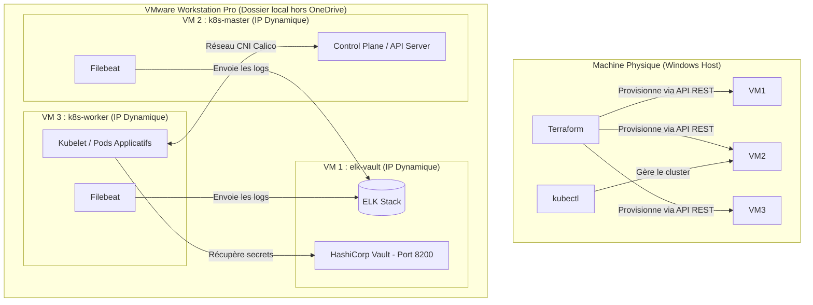

# Documentation Technique : Kubernetes Enterprise Platform (VMware & Terraform)

Ce document décrit en détail l'infrastructure, l'architecture cible, la configuration des fichiers de déploiement Terraform, les scripts d'automatisation, ainsi que le guide des commandes et la résolution des problèmes rencontrés.

---

## 1. Architecture Cible & Rôle des VMs

L'architecture est composée de 3 machines virtuelles (VMs) sous **Ubuntu Server 22.04/26.04 LTS** hébergées localement sur **VMware Workstation Pro**.



### Dimensionnement des Ressources (PC Hôte : 16 Go RAM)
*   **VM 1 (`elk-vault`)** : 2 vCPUs, 3 Go (3072 Mo) RAM. *Nécessaire car Elasticsearch requiert au moins 2 Go pour s'exécuter de façon stable.*
*   **VM 2 (`k8s-master`)** : 2 vCPUs, 2 Go (2048 Mo) RAM. *Minimum requis par Kubernetes pour le Control Plane.*
*   **VM 3 (`k8s-worker`)** : 1 vCPU, 2 Go (2048 Mo) RAM. *Suffisant pour les conteneurs de test.*

---

## 2. Guide des Fichiers Créés

### A. Fichiers Terraform (Dossier `/terraform`)

#### 1. Fichier `providers.tf`
Ce fichier déclare le connecteur (provider) pour VMware Workstation et configure la connexion à l'API REST locale.
```hcl
terraform {
  required_version = ">= 1.0.0"
  required_providers {
    vmworkstation = {
      source  = "elsudano/vmworkstation"
      version = "2.0.1"
    }
  }
}

provider "vmworkstation" {
  username = var.vmrest_user
  password = var.vmrest_password
  endpoint = var.vmrest_url
  https    = false
  debug    = "none"
}
```

#### 2. Fichier `variables.tf`
Il déclare toutes les variables utilisées dans notre code sans leur assigner de valeurs figées.
```hcl
variable "vmrest_user" {
  type        = string
  description = "Nom d'utilisateur pour l'API REST de VMware Workstation"
  default     = "admin"
}

variable "vmrest_password" {
  type        = string
  description = "Mot de passe pour l'API REST de VMware Workstation"
  sensitive   = true
}

variable "vmrest_url" {
  type        = string
  description = "URL locale de l'API REST de VMware Workstation"
  default     = "http://127.0.0.1:8697/api"
}

variable "base_vm_id" {
  type        = string
  description = "L'identifiant unique (sourceid) de la VM de base (modèle)"
}

variable "vm_base_dir" {
  type        = string
  description = "Chemin local de stockage des VMs (hors OneDrive)"
  default     = "C:\\Users\\farah\\Virtual Machines"
}
```

#### 3. Fichier `terraform.tfvars`
Il contient les valeurs réelles et privées de vos variables. *Ce fichier ne doit jamais être partagé sur Git.*
```hcl
vmrest_user     = "admin"
vmrest_password = "Secret123" # Remplacer par votre mot de passe API
vmrest_url      = "http://127.0.0.1:8697/api"
base_vm_id      = "JU1HB9H67D6MTFO9GQD12VIU2PJTI40E"
vm_base_dir     = "C:\\Users\\farah\\Virtual Machines"
```

#### 4. Fichier `main.tf`
Le fichier principal décrivant les 3 VMs clonées à partir de l'identifiant de la machine modèle.
```hcl
# 1. Déploiement de la VM ELK & Vault
resource "vmworkstation_virtual_machine" "elk_vault" {
  sourceid     = var.base_vm_id
  denomination = "elk-vault"
  path         = "${var.vm_base_dir}\\elk-vault\\elk-vault.vmx"
  processors   = 2
  memory       = 3072
  state        = "on"
}

# 2. Déploiement du Kubernetes Master (Control Plane)
resource "vmworkstation_virtual_machine" "k8s_master" {
  sourceid     = var.base_vm_id
  denomination = "k8s-master"
  path         = "${var.vm_base_dir}\\k8s-master\\k8s-master.vmx"
  processors   = 2
  memory       = 2048
  state        = "on"
}

# 3. Déploiement du Kubernetes Worker (Data Plane)
resource "vmworkstation_virtual_machine" "k8s_worker" {
  sourceid     = var.base_vm_id
  denomination = "k8s-worker"
  path         = "${var.vm_base_dir}\\k8s-worker\\k8s-worker.vmx"
  processors   = 1
  memory       = 2048
  state        = "on"
}
```

---

### B. Scripts de Configuration Interne (Dossier `/scripts`)

Ces scripts sont prévus pour être exécutés à l'intérieur des VMs Ubuntu Server après leur démarrage.

#### 1. Fichier `install_k8s.sh` (Pour `k8s-master` et `k8s-worker`)
Désactive le swap, configure les modules réseau du noyau, installe le runtime de conteneurs `containerd` et les composants Kubernetes (`kubeadm`, `kubelet`, `kubectl`).
```bash
#!/bin/bash
set -e

# Désactivation permanente du Swap (requis par K8s)
sudo swapoff -a
sudo sed -i '/ swap / s/^\(.*\)$/#\1/g' /etc/fstab

# Chargement des modules noyau
cat <<EOF | sudo tee /etc/modules-load.d/k8s.conf
overlay
br_netfilter
EOF
sudo modprobe overlay
sudo modprobe br_netfilter

# Configuration sysctl
cat <<EOF | sudo tee /etc/sysctl.d/k8s.conf
net.bridge.bridge-nf-call-iptables  = 1
net.bridge.bridge-nf-call-ip6tables = 1
net.ipv4.ip_forward                 = 1
EOF
sudo sysctl --system

# Installation de containerd
sudo apt-get update && sudo apt-get install -y ca-certificates curl gnupg lsb-release
sudo mkdir -p /etc/apt/keyrings
curl -fsSL https://download.docker.com/linux/ubuntu/gpg | sudo gpg --dearmor -o /etc/apt/keyrings/docker.gpg
echo "deb [arch=$(dpkg --print-architecture) signed-by=/etc/apt/keyrings/docker.gpg] https://download.docker.com/linux/ubuntu $(lsb_release -cs) stable" | sudo tee /etc/apt/sources.list.d/docker.list > /dev/null
sudo apt-get update && sudo apt-get install -y containerd.io

# Configuration SystemdCgroup pour containerd
sudo mkdir -p /etc/containerd
containerd config default | sed 's/SystemdCgroup = false/SystemdCgroup = true/g' | sudo tee /etc/containerd/config.toml > /dev/null
sudo systemctl restart containerd

# Ajout dépôt K8s & Installation
curl -fsSL https://pkgs.k8s.io/core:/stable:/v1.30/deb/Release.key | sudo gpg --dearmor -o /etc/apt/keyrings/kubernetes-apt-keyring.gpg
echo 'deb [signed-by=/etc/apt/keyrings/kubernetes-apt-keyring.gpg] https://pkgs.k8s.io/core:/stable:/v1.30/deb/ /' | sudo tee /etc/apt/sources.list.d/kubernetes.list
sudo apt-get update
sudo apt-get install -y kubelet kubeadm kubectl
sudo apt-mark hold kubelet kubeadm kubectl
sudo systemctl enable --now kubelet
```

#### 2. Fichier `install_elk.sh` (Pour `elk-vault`)
Installe Java JRE, ajoute les dépôts officiels Elastic et HashiCorp, puis installe Elasticsearch, Logstash, Kibana, et HashiCorp Vault.
```bash
#!/bin/bash
set -e

sudo apt-get update
sudo apt-get install -y wget curl gnupg2 apt-transport-https openjdk-17-jre-headless

# Dépôt Elastic
curl -fsSL https://artifacts.elastic.co/GPG-KEY-elasticsearch | sudo gpg --dearmor -o /etc/apt/keyrings/elasticsearch-keyring.gpg
echo "deb [signed-by=/etc/apt/keyrings/elasticsearch-keyring.gpg] https://artifacts.elastic.co/packages/8.x/apt stable main" | sudo tee /etc/apt/sources.list.d/elastic-8.x.list

# Dépôt HashiCorp (Vault)
curl -fsSL https://apt.releases.hashicorp.com/gpg | sudo gpg --dearmor -o /etc/apt/keyrings/hashicorp-archive-keyring.gpg
echo "deb [signed-by=/etc/apt/keyrings/hashicorp-archive-keyring.gpg] https://apt.releases.hashicorp.com $(lsb_release -cs) main" | sudo tee /etc/apt/sources.list.d/hashicorp.list

# Installation et activation des services
sudo apt-get update
sudo apt-get install -y elasticsearch kibana logstash vault
sudo systemctl enable elasticsearch kibana logstash vault
```

---

### C. Scripts Helpers PowerShell (Dossier `/scripts`)

#### 1. Script `get_vms.ps1`
Sert à récupérer la liste des VMs enregistrées dans l'API VMware REST locale avec leurs identifiants.
```powershell
$tfvars = Get-Content -Path "C:\Users\farah\kubernetes-enterprise-platform\terraform\terraform.tfvars"
$user = ""
$pass = ""
$url = ""
foreach ($line in $tfvars) {
    if ($line -match 'vmrest_user\s*=\s*"(.*)"') { $user = $Matches[1] }
    if ($line -match 'vmrest_password\s*=\s*"(.*)"') { $pass = $Matches[1] }
    if ($line -match 'vmrest_url\s*=\s*"(.*)"') { $url = $Matches[1] }
}

Write-Host "Connexion à $url avec l'utilisateur '$user'..."
$pair = $user + ":" + $pass
$bytes = [System.Text.Encoding]::UTF8.GetBytes($pair)
$base64 = [System.Convert]::ToBase64String($bytes)
$headers = @{ 
    Authorization = "Basic $base64"
    Accept = "application/vnd.vmware.v1+json"
}

try {
    $vms = Invoke-RestMethod -Uri "$url/vms" -Headers $headers -Method Get
    Write-Host "Machines trouvées :" -ForegroundColor Green
    $vms | Format-Table -Property id, path, denomination
} catch {
    Write-Error "Erreur lors de la connexion à l'API : $_"
}
```

---

## 3. Guide de Commandes PowerShell (Windows Hôte)

Voici l'enchaînement exact des commandes exécutées sur votre ordinateur Windows.

### A. Démarrer le service API REST VMware (Dans une console PowerShell Administrateur)
```powershell
# 1. Naviguer dans le dossier d'installation de VMware Workstation
cd "C:\Program Files (x86)\VMware\VMware Workstation"

# 2. Configurer les identifiants de l'API (à ne faire qu'une seule fois)
.\vmrest.exe -C

# 3. Démarrer l'API sur le port 8697
.\vmrest.exe -p 8697
```

### B. Commandes de dépannage / libération des fichiers (En mode Administrateur)
Si les fichiers de disques virtuels (`.nvram` ou `.vmdk`) sont verrouillés par des machines en cours d'exécution en tâche de fond :
```powershell
# 1. Arrêter les processus VMware en arrière-plan
Stop-Process -Name "vmware-vmx" -Force

# 2. Arrêter le client de l'API REST de VMware si bloqué
Stop-Process -Name "vmrest" -Force
```

### C. Lancement du déploiement Terraform (Dans la console normale du projet)
```powershell
# 1. Naviguer dans le dossier Terraform du projet
cd "C:\Users\farah\kubernetes-enterprise-platform\terraform"

# 2. Initialiser le dossier de travail (téléchargement du provider)
terraform init

# 3. Vérifier les actions prévues
terraform plan

# 4. Lancer le déploiement séquentiel (très important pour éviter les conflits d'API)
terraform apply -parallelism=1
```

---

## 4. Journal de Résolution des Problèmes (Debugging)

### Problème 1 : API VMware REST ne supporte pas la parallélisation
*   **Symptôme** : Lors du premier `terraform apply`, la création de la VM 1 réussit mais les deux autres échouent avec l'erreur `StatusCode:409 Message:The virtual machine has been locked`.
*   **Cause** : Par défaut, Terraform crée les ressources en même temps. VMware Workstation verrouille le fichier modèle `ubuntu-base.vmx` pendant qu'il effectue le premier clonage, empêchant les autres d'y accéder.
*   **Solution** : Utiliser l'argument `-parallelism=1` qui force Terraform à exécuter la recette de manière séquentielle (une machine après l'autre).

### Problème 2 : Conflit et lenteurs avec OneDrive
*   **Symptôme** : L'API VMware a mis plus de 3 minutes pour cloner une seule machine, provoquant un Timeout (`StatusCode:500 Internal server error`).
*   **Cause** : Les VMs étaient initialement stockées dans le dossier par défaut de VMware qui se trouvait dans `C:\Users\farah\OneDrive - ESPRIT\Documents\Virtual Machines`. OneDrive tentait de synchroniser les fichiers de disques virtuels de plusieurs gigaoctets au moment même où VMware les créait, saturant les accès disques (E/S).
*   **Solution** : 
    1.  Changer l'emplacement par défaut des VMs dans VMware Workstation (Edit -> Preferences -> Workspace -> Default location) pour pointer en local pur hors de OneDrive (`C:\Users\farah\Virtual Machines`).
    2.  Forcer l'arrêt des processus d'arrière-plan en cours (`Stop-Process -Name "vmware-vmx" -Force`) pour libérer les fichiers `.nvram` verrouillés, puis nettoyer les dossiers créés à moitié.
