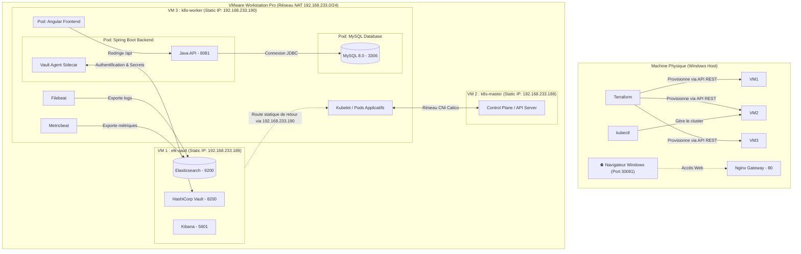

# Documentation Technique : Kubernetes Enterprise Platform (VMware & Terraform)

Ce document décrit en détail l'infrastructure, l'architecture cible, la configuration des fichiers de déploiement Terraform, les manifestes Kubernetes, les configurations de sécurité (Vault) et de supervision (ELK), ainsi que les guides de commandes et de résolution des problèmes rencontrés.

---

## 1. Architecture Cible & Rôle des VMs

L'architecture est composée de 3 machines virtuelles (VMs) sous **Ubuntu Server 22.04 LTS** hébergées localement sur **VMware Workstation Pro**, orchestrées par Terraform et Kubernetes pour faire tourner l'application web full-stack **WokMaster**.



### Dimensionnement des Ressources (PC Hôte : 16 Go RAM)
*   **VM 1 (`elk-vault`)** : 2 vCPUs, 3 Go (3072 Mo) RAM. *Elasticsearch requiert au moins 2 Go pour s'exécuter de façon stable.*
*   **VM 2 (`k8s-master`)** : 2 vCPUs, 2 Go (2048 Mo) RAM. *Minimum requis par Kubernetes pour le Control Plane.*
*   **VM 3 (`k8s-worker`)** : 1 vCPU, 2 Go (2048 Mo) RAM. *Suffisant pour héberger l'application WokMaster, MySQL, Filebeat et Metricbeat.*

---

## 2. Infrastructure as Code (Dossier `/terraform`)

### 1. Fichier `providers.tf`
Déclare le connecteur (provider) pour VMware Workstation et configure la connexion à l'API REST locale.
```hcl
terraform {
  required_version = ">= 1.0.0"
  required_providers {
    vmworkstation = {
      source  = "elsudano/vmworkstation"
      version = "2.0.1"
    }
  }
}

provider "vmworkstation" {
  username = var.vmrest_user
  password = var.vmrest_password
  endpoint = var.vmrest_url
  https    = false
  debug    = "none"
}
```

### 2. Fichier `variables.tf`
Déclare toutes les variables sans leur assigner de valeurs figées.
```hcl
variable "vmrest_user" {
  type        = string
  description = "Nom d'utilisateur pour l'API REST de VMware Workstation"
  default     = "admin"
}

variable "vmrest_password" {
  type        = string
  description = "Mot de passe pour l'API REST de VMware Workstation"
  sensitive   = true
}

variable "vmrest_url" {
  type        = string
  description = "URL locale de l'API REST de VMware Workstation"
  default     = "http://127.0.0.1:8697/api"
}

variable "base_vm_id" {
  type        = string
  description = "L'identifiant unique (sourceid) de la VM de base (modèle)"
}

variable "vm_base_dir" {
  type        = string
  description = "Chemin local de stockage des VMs (hors OneDrive)"
  default     = "C:\\Users\\farah\\Virtual Machines"
}
```

### 3. Fichier `terraform.tfvars` (Privé)
Contient les valeurs réelles et privées de vos variables.
```hcl
vmrest_user     = "admin"
vmrest_password = "Secret123"
vmrest_url      = "http://127.0.0.1:8697/api"
base_vm_id      = "JU1HB9H67D6MTFO9GQD12VIU2PJTI40E"
vm_base_dir     = "C:\\Users\\farah\\Virtual Machines"
```

### 4. Fichier `main.tf`
Description des 3 VMs clonées à partir de la machine modèle.
```hcl
resource "vmworkstation_virtual_machine" "elk_vault" {
  sourceid     = var.base_vm_id
  denomination = "elk-vault"
  path         = "${var.vm_base_dir}\\elk-vault\\elk-vault.vmx"
  processors   = 2
  memory       = 3072
  state        = "on"
}

resource "vmworkstation_virtual_machine" "k8s_master" {
  sourceid     = var.base_vm_id
  denomination = "k8s-master"
  path         = "${var.vm_base_dir}\\k8s-master\\k8s-master.vmx"
  processors   = 2
  memory       = 2048
  state        = "on"
}

resource "vmworkstation_virtual_machine" "k8s_worker" {
  sourceid     = var.base_vm_id
  denomination = "k8s-worker"
  path         = "${var.vm_base_dir}\\k8s-worker\\k8s-worker.vmx"
  processors   = 1
  memory       = 2048
  state        = "on"
}
```

---

## 3. Configuration Interne & Déploiement Kubernetes

### A. Manifestes de Déploiement Applicatif (Dossier `/kubernetes`)

#### 1. Fichier `mysql-deploy.yaml`
Déploie MySQL 8.0 en utilisant un stockage local (`hostPath`) sur le Worker pour assurer la persistance des données.
```yaml
apiVersion: apps/v1
kind: Deployment
metadata:
  name: mysql-db
  namespace: default
spec:
  replicas: 1
  selector:
    matchLabels:
      app: mysql-db
  template:
    metadata:
      labels:
        app: mysql-db
    spec:
      containers:
      - name: mysql
        image: mysql:8.0
        ports:
        - containerPort: 3306
        env:
        - name: MYSQL_DATABASE
          value: mydb
        - name: MYSQL_USER
          value: farah
        - name: MYSQL_PASSWORD
          value: MySuperSecretDBPassword
        - name: MYSQL_ROOT_PASSWORD
          value: MySuperRootPassword
        volumeMounts:
        - name: mysql-storage
          mountPath: /var/lib/mysql
      volumes:
      - name: mysql-storage
        hostPath:
          path: /mnt/data/mysql
          type: DirectoryOrCreate
---
apiVersion: v1
kind: Service
metadata:
  name: mysql-service
  namespace: default
spec:
  selector:
    app: mysql-db
  ports:
    - protocol: TCP
      port: 3306
      targetPort: 3306
```

#### 2. Fichier `backend-deploy.yaml`
Déploie l'API Spring Boot, configure l'accès à MySQL et expose le service via un port NodePort externe pour le Windows hôte.
```yaml
apiVersion: apps/v1
kind: Deployment
metadata:
  name: spring-backend
  namespace: default
spec:
  replicas: 1
  selector:
    matchLabels:
      app: spring-backend
  template:
    metadata:
      labels:
        app: spring-backend
    spec:
      containers:
      - name: backend
        image: farahbenchikha/spring-backend:v1
        imagePullPolicy: Always
        command: ["java"]
        args: ["-Djava.security.egd=file:/dev/./urandom", "-jar", "app.jar"]
        ports:
        - containerPort: 8081
        env:
        - name: SPRING_DATASOURCE_URL
          value: jdbc:mysql://mysql-service:3306/mydb?useSSL=false&allowPublicKeyRetrieval=true&serverTimezone=UTC
        - name: SPRING_DATASOURCE_USERNAME
          value: farah
        - name: SPRING_DATASOURCE_PASSWORD
          value: MySuperSecretDBPassword
---
apiVersion: v1
kind: Service
metadata:
  name: backend-service
  namespace: default
spec:
  type: NodePort
  selector:
    app: spring-backend
  ports:
    - protocol: TCP
      port: 8081
      targetPort: 8081
      nodePort: 30080
```

#### 3. Fichier `frontend-deploy.yaml`
Déploie l'application Angular servie par Nginx et l'expose sur le port `30081`.
```yaml
apiVersion: apps/v1
kind: Deployment
metadata:
  name: angular-frontend
  namespace: default
spec:
  replicas: 1
  selector:
    matchLabels:
      app: angular-frontend
  template:
    metadata:
      labels:
        app: angular-frontend
    spec:
      containers:
      - name: frontend
        image: farahbenchikha/angular-frontend:v1
        imagePullPolicy: Always
        ports:
        - containerPort: 80
---
apiVersion: v1
kind: Service
metadata:
  name: frontend-service
  namespace: default
spec:
  type: NodePort
  selector:
    app: angular-frontend
  ports:
    - port: 80
      targetPort: 80
      nodePort: 30081
```

---

### B. Configuration de la Sécurité (HashiCorp Vault)

Vault gère les secrets et les injecte automatiquement sous forme de fichiers partagés via un conteneur sidecar dans les pods Kubernetes.

#### 1. Initialisation de l'authentification K8s dans Vault
```bash
# Activer la méthode d'authentification Kubernetes
vault auth enable kubernetes

# Configurer la connexion à l'API Server de Kubernetes
vault write auth/kubernetes/config \
    kubernetes_host="https://192.168.233.188:6443" \
    kubernetes_ca_cert=@/var/run/secrets/kubernetes.io/serviceaccount/ca.crt \
    token_reviewer_jwt=@/var/run/secrets/kubernetes.io/serviceaccount/token
```

#### 2. Exemple d'injection via annotations (Sidecar Pattern)
```yaml
metadata:
  annotations:
    vault.hashicorp.com/agent-inject: "true"
    vault.hashicorp.com/role: "vault-demo-role"
    vault.hashicorp.com/agent-inject-secret-config: "secret/data/demo"
```

---

### C. Configuration de l'Observabilité (ELK Stack)

La supervision est assurée par Filebeat (logs) et Metricbeat (métriques CPU/RAM) déployés en tant que DaemonSets sur les nœuds du cluster.

#### 1. Configuration réseau (Netplan)
Pour permettre à la VM `elk-vault` de répondre aux agents situés dans le sous-réseau privé des conteneurs Kubernetes (`192.168.0.0/16`), une route statique de retour est déclarée dans `/etc/netplan/00-installer-config.yaml` sur la VM `elk-vault` :
```yaml
network:
  version: 2
  ethernets:
    ens33:
      addresses:
        - 192.168.233.189/24
      routes:
        - to: 192.168.0.0/16
          via: 192.168.233.190
```

---

## 4. Scripts d'Automatisation (Dossier `/scripts`)

### 1. Script de Sauvegarde `backup-db.sh`
Ce script effectue un export à chaud de la base de données MySQL dans Kubernetes et l'enregistre sur le Master.
```bash
#!/bin/bash
BACKUP_DIR="/home/farah/backups"
DB_USER="farah"
DB_NAME="mydb"
DB_PASS="MySuperSecretDBPassword"
TIMESTAMP=$(date +"%Y%m%d_%H%M%S")
BACKUP_FILE="${BACKUP_DIR}/${DB_NAME}_backup_${TIMESTAMP}.sql"

POD_NAME=$(kubectl get pods -l app=mysql-db -o jsonpath="{.items[0].metadata.name}" 2>/dev/null)
if [ -z "$POD_NAME" ]; then
    echo "❌ Erreur: Impossible de trouver un pod MySQL actif."
    exit 1
fi

mkdir -p ${BACKUP_DIR}
kubectl exec -i ${POD_NAME} -- mysqldump --no-tablespaces -u ${DB_USER} -p${DB_PASS} ${DB_NAME} > ${BACKUP_FILE}

if [ $? -eq 0 ]; then
    echo "🎉 SAUVEGARDE RÉUSSIE ! Fichier : ${BACKUP_FILE}"
else
    echo "❌ Erreur lors de la sauvegarde."
    exit 1
fi
```

### 2. Script de Restauration `restore-db.sh`
```bash
#!/bin/bash
DB_USER="farah"
DB_NAME="mydb"
DB_PASS="MySuperSecretDBPassword"

if [ -z "$1" ]; then
    echo "❌ Usage: $0 /chemin/vers/sauvegarde.sql"
    exit 1
fi
BACKUP_FILE="$1"

POD_NAME=$(kubectl get pods -l app=mysql-db -o jsonpath="{.items[0].metadata.name}" 2>/dev/null)
kubectl exec -i ${POD_NAME} -- mysql -u ${DB_USER} -p${DB_PASS} ${DB_NAME} < ${BACKUP_FILE}

if [ $? -eq 0 ]; then
    echo "🎉 RESTAURATION EFFECTUÉE AVEC SUCCÈS !"
else
    echo "❌ Erreur lors de la restauration."
    exit 1
fi
```

---

## 5. Journal de Résolution des Problèmes (Debugging)

### Problème 3 : Blocage d'entropie JVM (Entropy Hang)
*   **Symptôme** : Le conteneur Spring Boot démarre mais ne produit aucun log et le port `8080/8081` reste fermé.
*   **Cause** : La JVM a besoin de nombres aléatoires pour initialiser la couche de sécurité (Spring Security, JWT). Sur une machine virtuelle, l'entropie système est insuffisante, bloquant indéfiniment la lecture du fichier `/dev/random`.
*   **Solution** : Ajouter la variable système `-Djava.security.egd=file:/dev/./urandom` dans les arguments de démarrage Java du manifeste Kubernetes pour utiliser le générateur non-bloquant.

### Problème 4 : Erreurs CORS (Cross-Origin Resource Sharing)
*   **Symptôme** : L'accès à la page d'inscription réussit, mais cliquer sur le bouton de soumission renvoie l'erreur `CORS blocked: Invalid CORS request`.
*   **Cause** : Le frontend (port `30081`) et le backend (port `30080`) tournent sur des ports différents, ce qui est bloqué par la politique de sécurité des navigateurs.
*   **Solution** : 
    1.  Configurer un **Reverse Proxy Nginx** dans le conteneur Angular pour intercepter `/api/` et le rediriger vers le backend en interne.
    2.  Ajouter l'option `proxy_set_header Origin "";` dans `nginx.conf` pour forcer Nginx à supprimer l'en-tête de provenance, ce qui désactive le blocage CORS côté Spring Boot.

### Problème 5 : Conflit de type de Service Kubernetes (ClusterIP vers NodePort)
*   **Symptôme** : Tenter d'appliquer les ports mis à jour via `kubectl apply` génère une erreur d'incompatibilité de type.
*   **Cause** : Kubernetes n'autorise pas la modification directe d'un service existant de type `ClusterIP` vers `NodePort` si l'IP interne est déjà verrouillée.
*   **Solution** : Supprimer manuellement l'ancien service (`kubectl delete service backend-service`) puis ré-appliquer le manifeste pour forcer sa recréation.

### Problème 6 : Cache navigateur agressif sur Nginx
*   **Symptôme** : Même après la mise à jour de l'image Docker du Frontend, la page par défaut "Welcome to Nginx !" continue de s'afficher sur le port `30081`.
*   **Cause** : Chrome garde agressivement en cache la page statique d'accueil par défaut de Nginx.
*   **Solution** : Effectuer un rafraîchissement complet en vidant le cache du navigateur avec le raccourci **`Ctrl + F5`** ou en ouvrant une nouvelle fenêtre de Navigation Privée.
